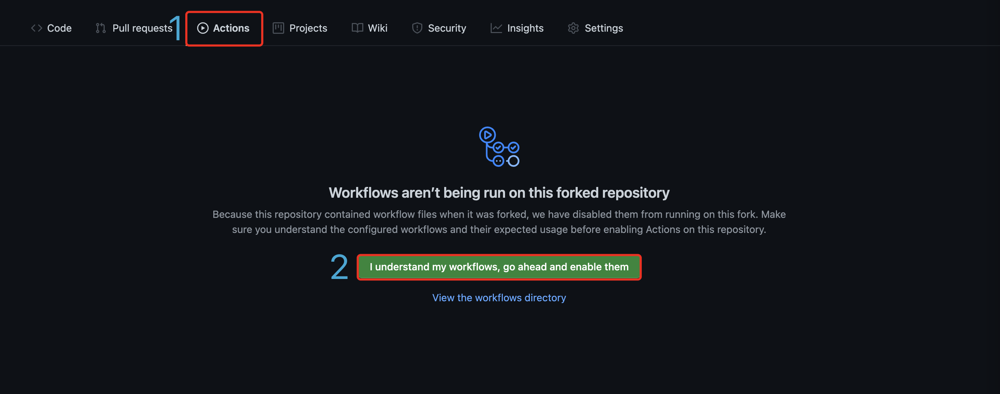
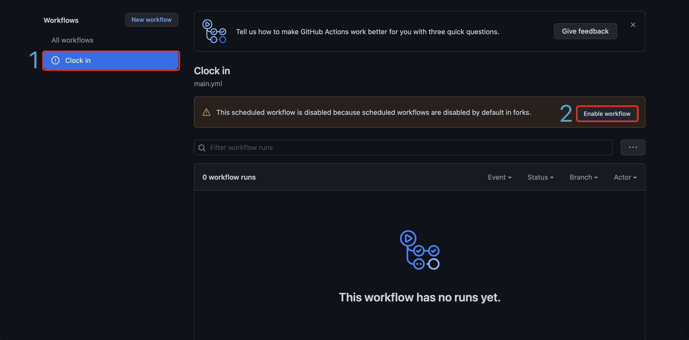
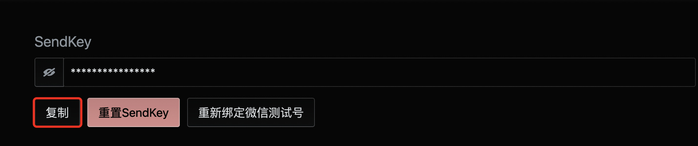
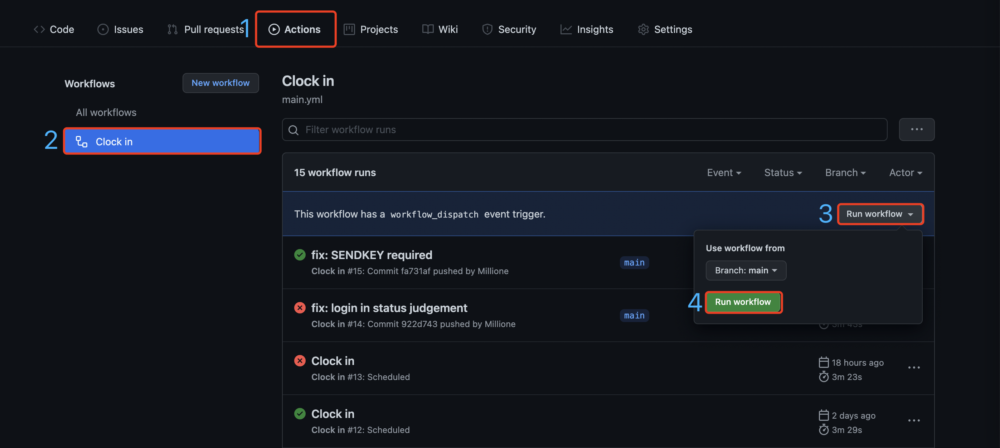
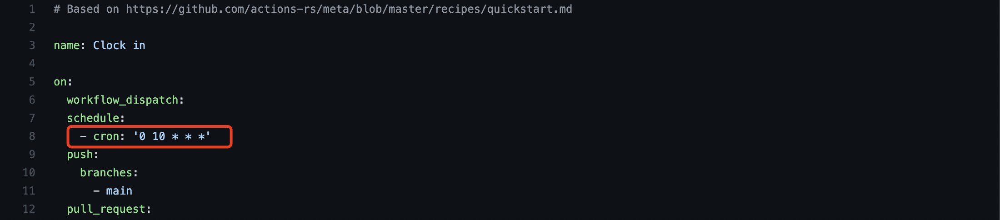

    
    <h3 align= "center">南京大学健康打卡</h3>

    
    
    
    

## 使用
1. Star & Fork 本仓库

2. 在 Fork 出来的个人仓库中点击 Settings -> Secrets -> New repository secret

3. 分别添加3个secret，如下 `Name`: `Value`

    * `USERNAME`: 统一认证账号
    * `PASSWORD`: 统一认证密码
    * `LOCATION`: 打卡位置

4. 点击 Actions -> I understand

5. 继续点击 Clock in -> Enable workflow

6. 完成，打卡将在每日北京时间18:00开始

## 微信打卡通知
1. 点击[Server酱](https://sct.ftqq.com/login)扫码关注，并在网页上点此继续

2. 点击获取[SENDKEY](https://sct.ftqq.com/sendkey)

3. 按[使用](#使用)步骤2、3添加secret，如下 `Name`: `Value`

   * `SENDKEY`: 步骤2获取值

## 注意
当打卡失败时请点击[统一身份认证](https://authserver.nju.edu.cn/authserver/login)进行手动认证（保证模拟登录时不需要验证码），并可按如下步骤再次尝试打卡

## 打卡时间修改
1. 修改`.github/workflows/main.yml`中如下参数

2. 10表示UTC时间10:00，对应北京时间18:00，修改此值即可修改打卡时间

3. 如若有复杂的定时需求，可自行查阅[cron](https://www.gairuo.com/p/cron-expression-sheet)规则进行相应修改

---
Related to [kottory](https://github.com/kottory/NJU-health-report)