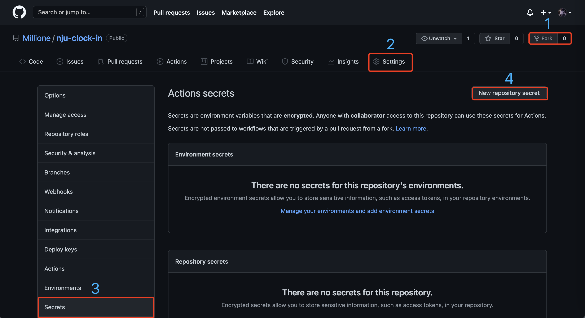

    
    <h2 align = "center">南京大学健康打卡</h2>

    
    
    
    

---
## 使用
1. Fork 本仓库

2. 点击 Settings -> Secrets -> New repository secret

3. 分别添加如下 `NAME`: `VALUE`

    * `USERNAME`: 统一认证账号
    * `PASSWORD`: 统一认证密码
    * `LOCATION`: 打卡位置

4. 完成，打卡将在每日北京时间18:00开始

## 打卡状态微信通知
1. 点击[Server酱](https://sct.ftqq.com/login)，微信扫码登录后关注

2. 网页点击按钮继续，并获取[SENDKEY](https://sct.ftqq.com/sendkey)

3. 按[使用](#使用)步骤2、3将SENDKEY添加进密钥中

    * `SENDKEY`: 网页获取值

---
Related to [kottory](https://github.com/kottory/NJU-health-report)